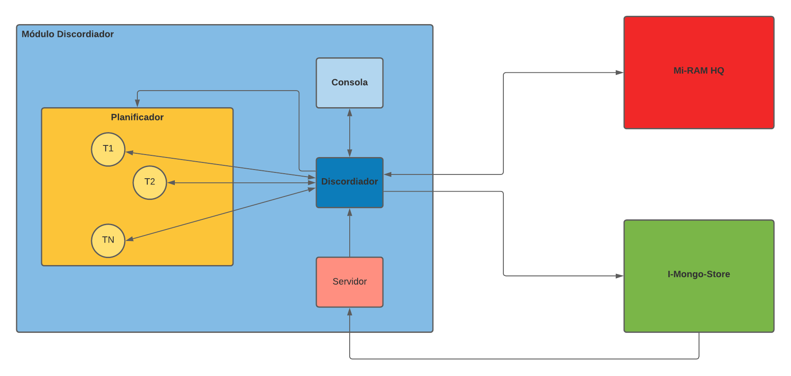
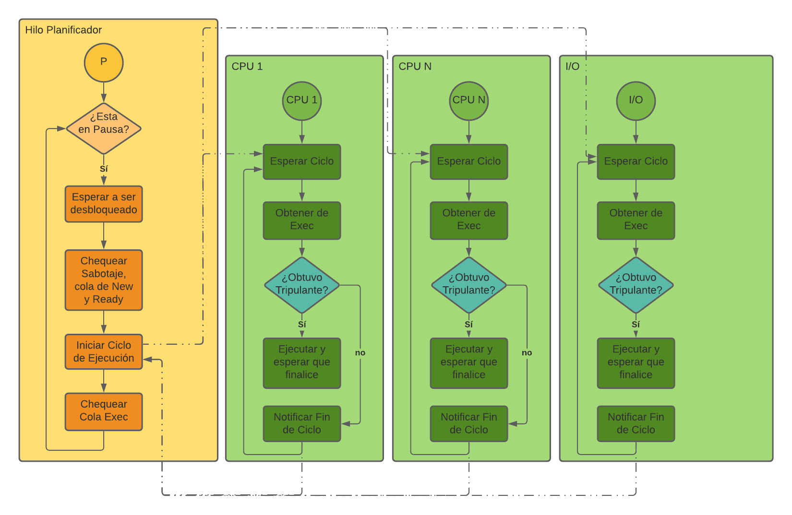

# Módulo Discordiador

El módulo Discordiador (al que nosotros apodamos a principio de cuatrimestre como _Discordia_) es el módulo planificador del sistema. La misma se encuentra dividida en:

- El Discordiador
- La Consola.
- Submódulo Planificador.
- Los diferentes hilos de cada tripulante.
- El Servidor.

El **Discordiador** sirve como interfaz para comunicar a los distintos submódulos con la memoria y el file system (algo así como el SO). Es el encargado de mantener las conexiones de los distintos tripulantes y la consola.

La **Consola** (como ya sabrán) es el encargado de recibir los input del usuario y mostrar los resultados de los comandos por consola (si es que se debe mostrar algo).

El **Planificador** es el submódulo encargado de ejecutar los ciclos de ejecución de las CPUs y el hilo de I/O, como así también seleccionar a los tripulantes a ejecutar y controlar el estado de la planifiación (en pausa, ejecución, sabotaje).

Los **Hilos de Tripulante** son los tripulantes en sí, los cuales ejecutan tareas y realizan movimientos dentro de la nave.

Por último, el **Servidor** tiene como único objetivo recibir las distintas notificaciones de sabotaje.

## Planificador

La gran complejidad del módulo se encuentra en el **Planificador**. Este debe cumplir que:

- Cada hilo de tripulante debe ser creado _a demanda_ (es decir, deben haber al menos tantos hilos de tripulantes como tripulantes se ingresen en el sistema).
- Se debe poder pausar la planificación en cualquier momento.
- Se debe ejecutar una rutína de sabotaje (especificada en el enunciado), la cual altera la planificación de todos los tripulantes.

Con todo esto en mente, tratamos de hacer el módulo lo mas parecido a la teoría como fuera posible. Con esto en mente, identificamos las siguientes entidades como parte del submódulo planificador:

- CPUs.
- Dispositivo I/O.
- Sincronizador.
- Colas del planificador.

Las interfaces de cada una se encuentran dentro de la carpeta _planificador_ en el discordiador.

La idea general es que el **Hilo Planificador** se encarge de planificar las estructuras de los tripulantes, aceptar nuevas patotas (siempre y cuando la planificación esté funcionando), mover los tripulantes entre colas, desbloquear los hilos de CPUs y buscar y eliminar a los tripulantes que se especifiquen en consola.

Los **Hilos de CPU** se encargan de obtener tripulantes de la cola de Exec y ejecutarlos. El ejecutarlos implica desbloquear el hilo del tripulante seleccionado y esperar a que este finalice su ciclo. Una vez hecho esto, la CPU notifica que el tripulante finalizo la ejecución y queda a la espera de que inicie el siguiente ciclo (el cual se iniciará una vez que todos las CPUs y el hilo de I/O finalicen, y siempre que la planificación no se encuentre pausada).

Los **Hilos de Tripulante** se encargan de ejecutar la lógica del tripulante. Es decir, realiza las acciones pertinentes a un tripulante (moverse, realizar una tarea (bloqueante o no)).

El siguiente diagrama muestra un gráfico reducido de la lógica detras de la arquitectura del planificador:

_Nota: Las lineas puteadas representan algun mecanismo de sincronización (semaforos, condicionales, etc)._

Para ver una versión mas detallada del diagrama anterior (y capaz algo desorganizado), [este diagrama en lucidchart](https://lucid.app/lucidchart/invitations/accept/inv_bf9e5e5b-9775-494b-a634-5d3ebddb9672?viewport_loc=-78%2C328%2C4489%2C1984%2C0_0) se expande mas, incluyendo en él los hilos de los tripulantes.

