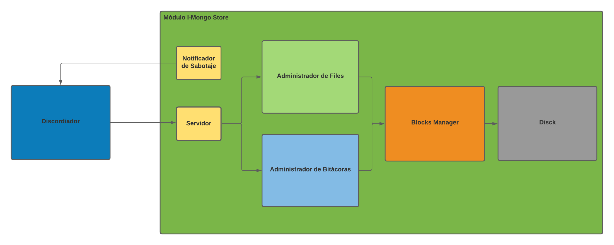

# Módulo I-Mongo Store
El módulo I-Mongo Store es el File System del sistema. La misma esta dividida en:
*   El Disco.
*   El Administardor de Bloques.
*   El Administrador de Archivos o Files.
*   El Administrador de Bitacoras.
*   El Servidor.
*   El Notificador de Sabotaje.

Todas las notificaciones y actualizaciones del Discordiador son recibidas por el Servidor, el cual se lo pasa al File System y este, dependiendo del mensaje, actualiza los archivos necesarios (ya sea Files o Bitácoras).

Tanto el **Administrador de Files** como el **Administrador de Bitácoras** se encargan de mantener en memoria las estructuras necesarias para poder mapear los archivos dentro del disco. Estos interactuan con el **Block Manager**, el cual permite leer, escribir, asignar y liberar bloques del Disco. El **Block Manager** mantiene, también, los archivos de _SuperBlock.ims_ y _Blocks.ims_.

El **Notificador de Sabotaje** tienen como único objetivo interceptar los signals y notificar de los sabotajes al Discordiador.

